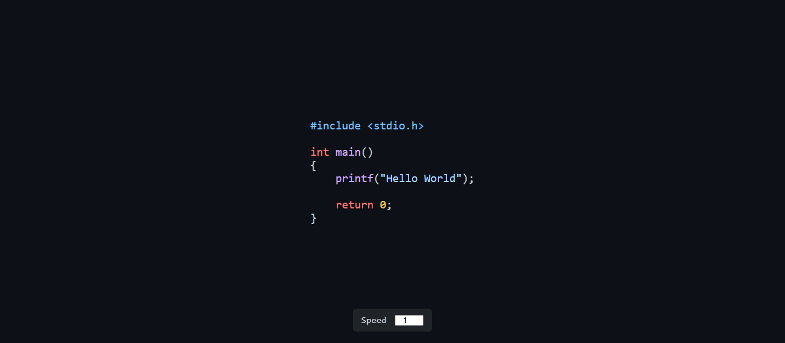

# C Code Color Typing Effect

A simple **HTML, CSS, and JavaScript** project that simulates a **typing animation with syntax highlighting** for C code. The code is typed character-by-character on the screen, with adjustable typing speed and colored keywords similar to a code editor.

---

## 🖼️ Preview



> *Screenshot or GIF showing the typing animation with syntax highlighting.*

---

## ✨ Features

* Typing animation effect for C code
* Basic syntax highlighting:

  * `#include` statements
  * Keywords (`int`, `return`)
  * Functions (`main`, `printf`)
  * Strings and numbers
* Adjustable typing speed (1–5)
* Dark theme inspired by GitHub code editor
* Pure HTML, CSS, and JavaScript (no libraries)

---

## 📁 Project Structure

```
├── index.html   # Main HTML file
├── style.css    # Styling and syntax colors
└── script.js    # Typing logic and highlighting
```

---

## 🚀 How to Run

1. Download or clone the repository
2. Open `index.html` in any modern web browser
3. Use the **Speed** input at the bottom to control typing speed

No server or installation required.

---

## 🧠 How It Works

* The C code is stored as a string in `script.js`
* Characters are revealed one by one using `setTimeout()`
* Regex-based replacements apply syntax highlighting
* HTML special characters (`<` and `>`) are escaped for safety
* When typing finishes, it restarts automatically

---

## 🎨 Customization

### Change the Code

Edit the `code` variable inside `script.js`:

```js
const code = `#include <stdio.h>

int main()
{
    printf("Hello World");

    return 0;
}`;
```

### Change Colors

Modify syntax colors in `style.css`:

```css
.keyword { color: #ff7b72; }
.func    { color: #d2a8ff; }
.string  { color: #a5d6ff; }
```

### Change Speed Range

Adjust the input range in `index.html`:

```html
<input type="number" id="speed" value="1" min="1" max="5">
```

---

## 📌 Use Cases

* Programming animations
* Educational demos
* Coding-themed websites
* Landing page visuals
* UI experiments

---

## 📄 License

This project is open-source and free to use for learning and personal projects.

---

If you want, I can also:

* Convert this into a **React component**
* Add **more C keywords**
* Add **cursor blinking effect**
* Support **multiple programming languages**
